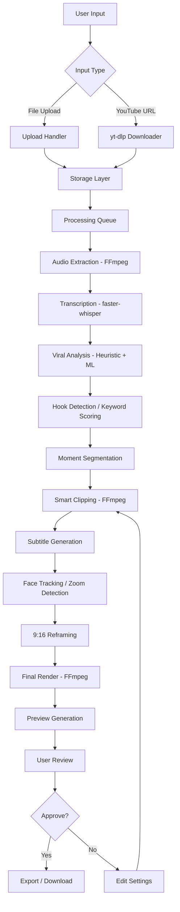

# 🌙 MOONLIGHT — PROJECT MAP

> AI-Powered Viral Clip Generator Platform
> Status: ARCHITECTURE PHASE

---

## [PRODUCT_VISION]

MoonLight transforms long-form video content (podcasts, streams, YouTube videos, recordings) into viral-ready short-form clips (TikTok, Shorts, Reels) using AI. One-click content repurposing engine.

**Tagline:** *Turn long content into viral moments. Instantly.*

### Core Value Prop
- Upload once, get 10+ viral clips
- Auto-captions with emoji styling
- Smart face tracking & dynamic zooms
- 9:16 reframing for all platforms
- 100% free to build & host

---

## [TECH_STACK]

| Layer | Technology | Version | License |
|-------|-----------|---------|---------|
| **Runtime** | Node.js | 20.20.0 LTS | MIT |
| **Package Manager** | pnpm | 10.28.1 | MIT |
| **Framework** | Next.js | 15.x (latest stable) | MIT |
| **Language** | TypeScript | 5.x | Apache 2.0 |
| **Styling** | TailwindCSS | 4.x | MIT |
| **UI** | shadcn/ui + Radix | latest | MIT |
| **Animation** | Framer Motion | 12.x | MIT |
| **Icons** | Lucide React | latest | ISC |
| **Backend** | Next.js API Routes (or Fastify) | - | MIT |
| **Database ORM** | Prisma | 6.x | Apache 2.0 |
| **Database** | PostgreSQL (via Supabase Free) | 15.x | PostgreSQL |
| **AI/ML** | faster-whisper (Python) | latest | MIT |
| **AI/ML** | ONNX Runtime | latest | MIT |
| **Video** | FFmpeg | 7.1.1 | GPL |
| **Downloader** | yt-dlp | latest | Unlicense |
| **Face Detection** | MediaPipe / OpenCV | latest | Apache 2.0 |

---

## [SYSTEM_FLOW]



---

## [AI_PIPELINE]

```
RAW VIDEO
    │
    ├─ 1. AUDIO EXTRACTION
    │      ffmpeg -i input.mp4 -vn -acodec pcm_s16le audio.wav
    │
    ├─ 2. SPEECH-TO-TEXT
    │      faster-whisper → segments[] with {start, end, text, confidence}
    │
    ├─ 3. VIRAL MOMENT DETECTION
    │      ├─ Keyword scoring (emotional words, hooks, questions)
    │      ├─ Volume/energy analysis (FFmpeg loudnorm)
    │      ├─ Pause/silence detection (speech gaps)
    │      └─ Sentiment scoring (positive/negative peaks)
    │
    ├─ 4. MOMENT RANKING
    │      Score each 15-60s window → rank by virality potential
    │
    ├─ 5. SMART CLIPPING
    │      ffmpeg -ss start -to end -i input.mp4 clip.mp4
    │
    ├─ 6. SUBTITLE BURN-IN
    │      ├─ SRT generation from whisper segments
    │      ├─ Styled ASS subtitles (neon/glow/emoji)
    │      └─ ffmpeg subtitles filter burn-in
    │
    ├─ 7. FACE TRACKING
    │      ├─ MediaPipe face detection per frame (simple)
    │      └─ Center-of-mass tracking for smart crop
    │
    ├─ 8. DYNAMIC ZOOM
    │      ├─ Detect speech segments → gentle zoom in
    │      ├─ Detect silence/pauses → zoom out
    │      └─ ffmpeg zoompan filter
    │
    ├─ 9. 9:16 REFRAME
    │      ├─ Face-centered crop with padding
    │      └─ ffmpeg crop filter
    │
    └─ 10. FINAL EXPORT
            ├─ H.264 encode (libx264)
            ├─ AAC audio
            └─ 1080×1920 @ 30fps
```

---

## [ARCHITECTURE]

```
moonlight/
│
├── apps/
│   ├── web/                          # Next.js 15 — Main web application
│   │   ├── src/
│   │   │   ├── app/                  # App Router pages
│   │   │   │   ├── (marketing)/      # Landing, About, Pricing, FAQ
│   │   │   │   ├── (dashboard)/      # Dashboard (auth-protected)
│   │   │   │   └── api/              # API routes
│   │   │   ├── components/
│   │   │   │   ├── ui/               # shadcn primitives
│   │   │   │   ├── landing/          # Landing page sections
│   │   │   │   ├── dashboard/        # Dashboard components
│   │   │   │   ├── video/            # Video player, upload, preview
│   │   │   │   └── effects/          # Caption styling, effects UI
│   │   │   ├── hooks/               # React hooks
│   │   │   ├── lib/                 # Utilities, API clients
│   │   │   ├── stores/              # Zustand stores
│   │   │   └── types/               # TypeScript types
│   │   ├── public/                  # Static assets
│   │   ├── tailwind.config.ts
│   │   ├── next.config.ts
│   │   └── package.json
│   │
│   └── worker/                       # Background processing worker
│       ├── src/
│       │   ├── pipeline/             # AI pipeline stages
│       │   │   ├── audio.ts
│       │   │   ├── transcribe.ts
│       │   │   ├── detect-viral.ts
│       │   │   ├── clip.ts
│       │   │   ├── subtitles.ts
│       │   │   ├── face-track.ts
│       │   │   ├── zoom.ts
│       │   │   ├── reframe.ts
│       │   │   └── render.ts
│       │   ├── queue/               # Job queue
│       │   ├── storage/             # File I/O
│       │   └── index.ts             # Worker entry
│       ├── python/                  # Python ML scripts
│       │   ├── transcribe.py        # faster-whisper wrapper
│       │   ├── detect_viral.py      # Viral detection heuristics
│       │   └── requirements.txt
│       └── package.json
│
├── packages/
│   ├── ai/                           # AI types & shared logic
│   │   ├── src/
│   │   │   ├── types.ts
│   │   │   └── scoring.ts
│   │   └── package.json
│   │
│   ├── video/                        # FFmpeg wrapper utilities
│   │   ├── src/
│   │   │   ├── ffmpeg.ts
│   │   │   └── types.ts
│   │   └── package.json
│   │
│   ├── subtitles/                    # SRT/ASS generation
│   │   ├── src/
│   │   │   ├── generator.ts
│   │   │   ├── styles.ts
│   │   │   └── types.ts
│   │   └── package.json
│   │
│   ├── ui/                           # Shared UI components
│   │   ├── src/
│   │   │   ├── button.tsx
│   │   │   ├── card.tsx
│   │   │   ├── input.tsx
│   │   │   ├── dialog.tsx
│   │   │   └── ...
│   │   └── package.json
│   │
│   └── shared/                       # Shared types & utilities
│       ├── src/
│       │   ├── types.ts
│       │   ├── logger.ts
│       │   └── constants.ts
│       └── package.json
│
├── infrastructure/                   # Deployment configs
│   ├── supabase/
│   │   └── schema.sql
│   └── vercel.json
│
├── scripts/                          # Dev scripts
│   ├── setup.sh
│   └── dev.sh
│
├── PROJECT_MAP.md                    # This file
├── README.md
├── package.json                      # Root workspace
├── pnpm-workspace.yaml
├── tsconfig.base.json
└── turbo.json                       # Turborepo config
```

---

## [DEPENDENCIES]

### Production Dependencies

| Package | Purpose | Size Impact |
|---------|---------|-------------|
| next | Framework | ~70MB |
| react / react-dom | UI | ~10MB |
| tailwindcss | Styling | ~10MB |
| framer-motion | Animations | ~5MB |
| lucide-react | Icons | ~1MB |
| @prisma/client | Database | ~5MB |
| zustand | State management | ~1MB |
| sharp | Image processing | ~10MB |
| fluent-ffmpeg | FFmpeg bindings | ~1MB |
| @radix-ui/* | UI primitives | ~2MB |
| class-variance-authority | CSS variants | ~0.1MB |
| clsx / tailwind-merge | Class utilities | ~0.1MB |

### Python Dependencies (Worker)

| Package | Purpose | Size Impact |
|---------|---------|-------------|
| faster-whisper | Speech-to-text | ~2GB (model) |
| opencv-python | Computer vision | ~50MB |
| mediapipe | Face detection | ~30MB |
| onnxruntime | ML inference | ~20MB |
| numpy | Numeric | ~20MB |
| yt-dlp | YouTube download | ~10MB |

### Dev Dependencies

| Package | Purpose |
|---------|---------|
| typescript | Language |
| @types/react | Types |
| eslint | Linting |
| prettier | Formatting |
| turbo | Monorepo management |
| prisma | Database schema |
| postcss | CSS processing |

---

## [COST_ANALYSIS]

### Hosting (All Free Tier)

| Service | Tier | Limits | Our Usage |
|---------|------|--------|-----------|
| **Vercel** | Hobby | 100GB bandwidth, 100h serverless | Web app + API |
| **Supabase** | Free | 500MB DB, 1GB storage, 2GB bandwidth | DB + file storage |
| **GitHub** | Free | Unlimited repos | Source code |
| **Cloudflare** | Free | Unlimited bandwidth | Static assets (optional) |

### Zero-Cost AI Strategy

| AI Feature | Solution | Cost |
|------------|----------|------|
| Speech-to-text | faster-whisper (local CPU) | $0 |
| Viral detection | Heuristic + keyword scoring | $0 |
| Face tracking | MediaPipe / OpenCV | $0 |
| Subtitle generation | Custom SRT/ASS generator | $0 |
| Video processing | FFmpeg (local) | $0 |
| Download | yt-dlp | $0 |

### If Scaling (Future)

| Scale Issue | Solution | Cost |
|-------------|----------|------|
| Whisper too slow | GPU instance (RunPod $0.30/hr) | ~$0.30/hr |
| Storage full | Supabase Pro ($25/mo) | $25/mo |
| Need more processing | Railway ($5/mo) | $5/mo |

---

## [CURRENT_STATUS]

```
Phase    : MONETIZATION SYSTEM
Status   : COMPLETE
Progress : 83%
```

### Milestones

| # | Milestone | Status | Est. Time |
|---|-----------|--------|-----------|
| 1 | Architecture & Planning | ✅ COMPLETE | Complete |
| 2 | Tooling & Environment Setup | ✅ COMPLETE | Complete |
| 3 | Landing Page | ✅ COMPLETE | Complete |
| 4 | Dashboard | ✅ COMPLETE | Complete |
| 5 | Video Upload System | ✅ COMPLETE | Complete |
| 6 | AI Processing Engine | ✅ COMPLETE | Complete |
| 7 | Subtitle & Effects Engine | ✅ COMPLETE | Complete |
| 8 | Export Engine | ✅ COMPLETE | Complete |
| 9 | Monetization System | ✅ COMPLETE | Complete |
| 10 | Performance Optimization | ⏸️ PENDING | ~1 hr |
| 4 | Landing Page | ⏸️ PENDING | ~2 hrs |
| 5 | Dashboard | ⏸️ PENDING | ~2 hrs |
| 6 | Video Upload System | ⏸️ PENDING | ~1 hr |
| 7 | AI Processing Engine | ⏸️ PENDING | ~3 hrs |
| 8 | Subtitle & Effects Engine | ⏸️ PENDING | ~2 hrs |
| 9 | Export Engine | ⏸️ PENDING | ~2 hrs |
| 10 | Monetization System | ⏸️ PENDING | ~1 hr |
| 11 | Performance Optimization | ⏸️ PENDING | ~1 hr |
| 12 | Final QA | ⏸️ PENDING | ~1 hr |

---

## [KNOWN_LIMITATIONS]

1. **CPU-bound Whisper**: faster-whisper on CPU is ~2-5x slower than GPU. A 1hr video may take 10-20min to transcribe.
2. **No GPU Access**: All ML inference runs on CPU. No real-time processing.
3. **RAM Constraints**: Whisper model uses ~2GB RAM. Workers need at least 4GB available.
4. **Upload Size**: Vercel serverless has 4.5MB body limit. Need to use direct-to-storage uploads or chunked uploads.
5. **Vercel 10s timeout**: API routes timeout at 10s on Hobby plan. Async queue processing required.
6. **Whisper Model Files**: ~2GB download required for the large model. Use `base` or `small` model (~500MB) for free-tier viability.
7. **No Real-time Processing**: All processing is async. User uploads → queue → webhook/polling for result.
8. **Browser Subtitles**: ASS subtitle rendering in browser may need canvas-based approach for preview.

---

## [OPTIMIZATION_NOTES]

### Whisper Optimization
- Use `base` model (~150MB) for initial deployment — 5x faster than `large`, good enough accuracy
- Batch processing with whisper's built-in VAD for silence skipping
- Parallel audio chunks where possible

### FFmpeg Optimization
- Use `libx264 -preset ultrafast` for development, `-preset medium` for production
- Hardware encoding via MediaFoundation (`h264_amf` on Windows) if available
- Pipe streams instead of intermediate files where possible

### Memory Optimization
- Stream FFmpeg output directly to whisper (pipe)
- Delete intermediate files immediately after each pipeline stage
- Use disk spilling for large files

---

## [ORPHANS_AND_PENDING]

- [ ] Verify Windows compatibility for Python ML libraries (mediapipe, onnxruntime)
- [ ] Check if faster-whisper CUDA support works on this system
- [ ] Test yt-dlp on Windows
- [ ] Determine best upload strategy for serverless (Vercel)
- [ ] Evaluate using WebAssembly whisper (whisper.cpp) for browser-based transcription
